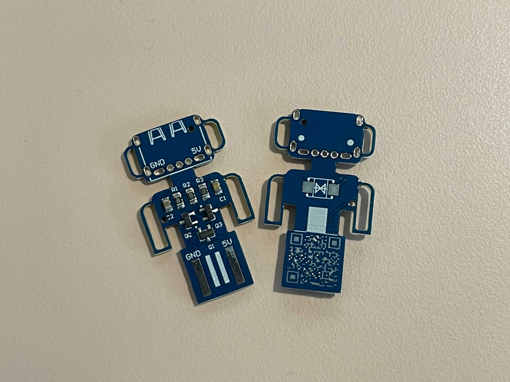

# ICRS Badge

This ICRS Badge hosts a ideal diode circuit with two BJT transistors and some passives. It blocks reverse voltage on the USB 2.0 +5V line, forming a basic USB protector. Additionally, there's some space for a TVS diode on the front, which would allow you to clamp the maximum voltage to a safe/desired level.

Unfortunately I've lost the schematic and layout of this design, but I still have the [Gerber files](gerber/) if you'd like to order one for yourself! Or ask the ICRS committee if they have any left.